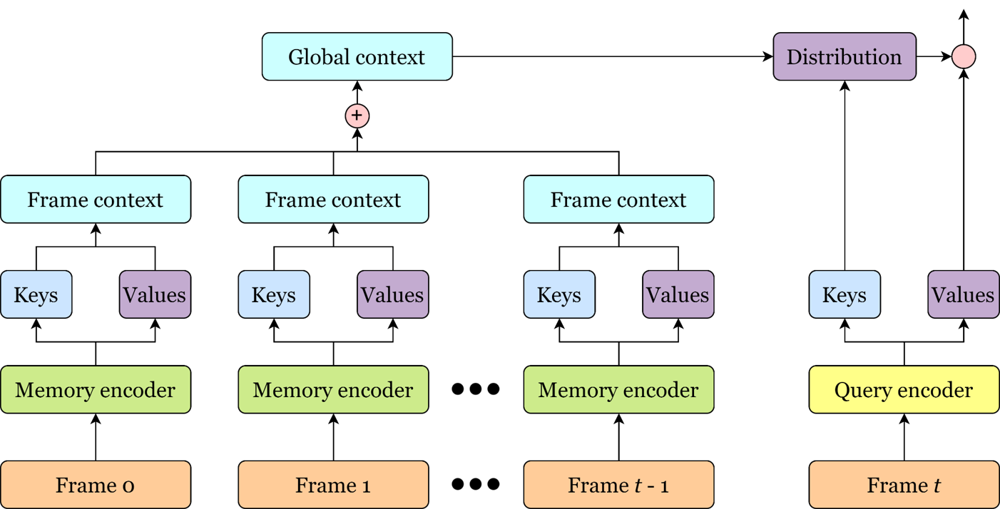

# Efficient Attention

The repository of ECCV 2020 paper [Fast Video Object Segmentation using the Global Context Module](https://arxiv.org/abs/2001.11243). **Source code release is pending approval.**

## Description



The global context module dramatically reduces the memory usage and computational load of the [space-time memory module](https://github.com/seoungwugoh/STM) with no loss of accuracy. The illustration above illustrate the module architecture. The global context module enables the first real-time video object segmentor with state-of-the-art accuracy.

## Resources

YouTube:
- 1-min presentation: https://youtu.be/v9zMUuuYRHc
- 10-min presentation: https://youtu.be/wCZrflUF61A

bilibili (for users in mainland China):
- 1-min presentation: https://www.bilibili.com/video/BV1Wv411v7i2/
- 10-min presentation: https://www.bilibili.com/video/BV1WD4y127SC/
- Presentation in Chinese: https://www.bilibili.com/video/BV1Hz4y1Q7Lb/

## Citation

If you use, compare with, or refer to this work, please cite

```bibtex
@inproceedings{li2020fast,
    title = {Fast Video Object Segmentation using the Global Context Module},
    author = {Yu Li and Zhuoran Shen and Ying Shan},
    booktitle = {ECCV},
    year = {2020},
}
```
